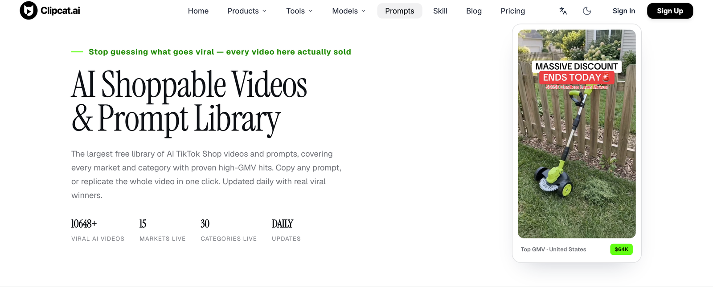
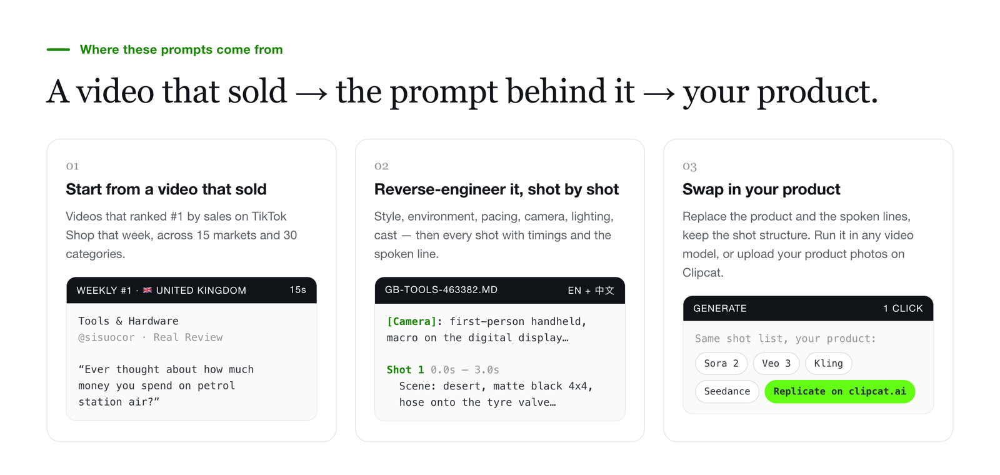
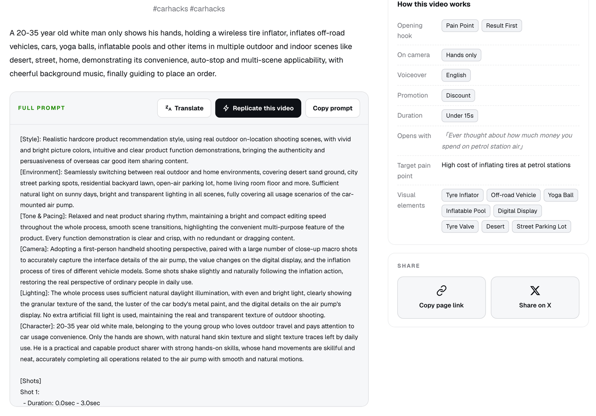
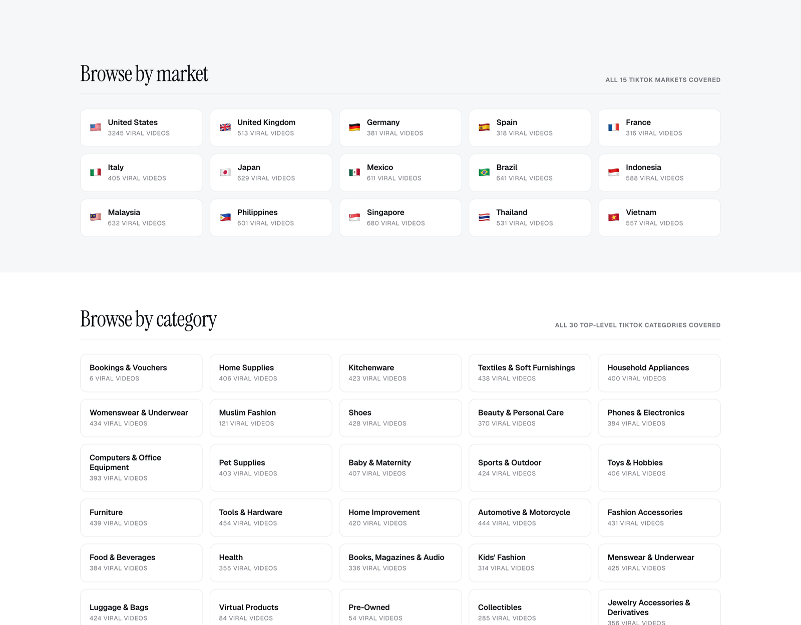

# 🎬 Awesome TikTok Shop Video Prompts

[](https://github.com/sindresorhus/awesome)
[](https://github.com/Clipcat-ai/awesome-tiktok-shop-video-prompts)
[](./LICENSE)
[](./CONTRIBUTING.md)

[](https://clipcat.ai/en/tools/ai-tiktok-videos-prompt?utm_source=github&utm_medium=repo&utm_campaign=prompt-library)
[](https://clipcat.ai/en/tools/ai-tiktok-videos-prompt?utm_source=github&utm_medium=repo&utm_campaign=prompt-library)
[](https://clipcat.ai/en/tools/ai-tiktok-videos-prompt?utm_source=github&utm_medium=repo&utm_campaign=prompt-library)
[](https://clipcat.ai/en/tools/ai-tiktok-videos-prompt?utm_source=github&utm_medium=repo&utm_campaign=prompt-library)

**中文 → [README_ZH.md](./README_ZH.md)**

<p align="center">
  <a href="https://clipcat.ai/en/tools/ai-tiktok-videos-prompt?utm_source=github&utm_medium=repo&utm_campaign=prompt-library"></a>
</p>

**These prompts are reverse-engineered from real TikTok Shop selling videos.** Each one describes a video that ranked #1 by sales in its market and category that week. Nothing here is written by hand — every prompt is a shot-by-shot reconstruction of a real video, and every entry links to the video it came from.

This repo holds part of the [Clipcat video and prompt library](https://clipcat.ai/en/tools/ai-tiktok-videos-prompt?utm_source=github&utm_medium=repo&utm_campaign=prompt-library) as plain Markdown files, so you can read them on GitHub, grep them and fork them. The full library is on clipcat.ai: **10,648+ videos across 15 markets and 30 categories, updated daily**, with search, filters, and one-click replication using your own product photos.

> 🤖 Want your AI agent to search this library and write a ready-to-shoot prompt for *your* product? 👉 [clipcat-skill](https://github.com/Clipcat-ai/clipcat-skill)

---

## Where these prompts come from

<p align="center">
  <a href="https://clipcat.ai/en/tools/ai-tiktok-videos-prompt?utm_source=github&utm_medium=repo&utm_campaign=prompt-library"></a>
</p>

---

## What is in each entry

Every file under `prompts/<market>/<category>/` holds one entry:

- **the prompt, in English and Chinese** — style, environment, pacing, camera, lighting, cast, then a shot-by-shot breakdown with timings and spoken lines;
- **the opening line** — the first line spoken in the video (quoted as-is when it was in English, translated when it was not), and the pain point it targets;
- **structured labels** — video format, hook type, who is on camera, promo mechanism, voiceover language;
- **a link to the original TikTok video**, so you can watch what the prompt describes.

The repo does not include video files, cover images, product photos or sales figures. See [NOTICE.md](./NOTICE.md).

### What one looks like

<p align="center">
  <a href="https://clipcat.ai/en/tools/ai-tiktok-videos-prompt/gb-tools-463382?utm_source=github&utm_medium=repo&utm_campaign=prompt-library"></a>
</p>

<p align="center"><sub>The entry below, <a href="https://clipcat.ai/en/tools/ai-tiktok-videos-prompt/gb-tools-463382?utm_source=github&utm_medium=repo&utm_campaign=prompt-library">as it looks on clipcat.ai</a>: the same prompt, plus the original video and a Replicate button.</sub></p>

<details open>
<summary><b>Cordless Tyre Inflator Air… — Real Review (United Kingdom · Tools & Hardware)</b> — <code>gb-tools-463382</code></summary>

```text
[Style]: Realistic hardcore product recommendation style, using real outdoor on-location shooting scenes, with vivid and bright picture colors, intuitive and clear product function demonstrations, bringing the authenticity and persuasiveness of overseas car good item sharing content.
[Environment]: Seamlessly switching between real outdoor and home environments, covering desert sand ground, city street parking spots, residential backyard lawn, open-air parking lot, home living room floor and more. Sufficient natural light on sunny days, bright and transparent lighting in all scenes, fully covering all usage scenarios of the car-mounted air pump.

Shot 1:
  - Duration: 0.0sec - 3.0sec
  - Scene Type: Setting the pressure value
  - Scene: In a desert sand scene, a matte black off-road vehicle is parked on the sand with its tire underinflated. A hand holds a black handheld air pump, connecting the air hose to the tire valve of the off-road vehicle. The camera slowly pushes in from the side of the tire, clearly showing the process of the tire gradually recovering from a deflated state to full. White title text is overlaid at the top of the frame, and explanatory text indicating that the video content has been accelerated is marked at the bottom.
  - Subject: Ever thought about how much money you spend on petrol station air?
…
```

[Read the full entry →](./prompts/gb/tools-hardware/gb-tools-463382.md) · [Watch the original video →](https://www.tiktok.com/share/video/7614465584268463382) · [Replicate it on clipcat.ai →](https://clipcat.ai/en/tools/ai-tiktok-videos-prompt/gb-tools-463382?utm_source=github&utm_medium=repo&utm_campaign=prompt-library)

</details>

---

## How to use these

**With any video model.** Copy the English or Chinese prompt into Sora 2, Veo 3, Kling, Seedance or whatever you run. The prompts are plain text and not tied to one model. The shot list is the part that matters.

**Swap in your own product.** The prompts describe someone else's product. Replace the product names and the spoken lines, and keep the shot structure as it is.

**With Clipcat.** Each entry links to the same prompt on [clipcat.ai](https://clipcat.ai/en/tools/ai-tiktok-videos-prompt?utm_source=github&utm_medium=repo&utm_campaign=prompt-library), where you can upload your own product images and generate the whole video.

---

## The prompt format

[docs/prompt-format.md](./docs/prompt-format.md) explains what each block means. [docs/hook-taxonomy.md](./docs/hook-taxonomy.md) lists the 13 opening-hook types and 13 video formats used as labels.

---

## Browse the library

<p align="center">
  <a href="https://clipcat.ai/en/tools/ai-tiktok-videos-prompt?utm_source=github&utm_medium=repo&utm_campaign=prompt-library"></a>
</p>

The counts below are video totals on [clipcat.ai](https://clipcat.ai/en/tools/ai-tiktok-videos-prompt?utm_source=github&utm_medium=repo&utm_campaign=prompt-library). Click a row to see the videos and prompts for that market, category or format. The entries included in this repo are under `prompts/<market>/<category>/`.

### By market

| Market | Videos | Market | Videos |
| --- | ---: | --- | ---: |
| [🇺🇸 United States](https://clipcat.ai/en/tools/ai-tiktok-videos-prompt/browse/country-us?utm_source=github&utm_medium=repo&utm_campaign=prompt-library) | 3,245 | [🇻🇳 Vietnam](https://clipcat.ai/en/tools/ai-tiktok-videos-prompt/browse/country-vn?utm_source=github&utm_medium=repo&utm_campaign=prompt-library) | 557 |
| [🇸🇬 Singapore](https://clipcat.ai/en/tools/ai-tiktok-videos-prompt/browse/country-sg?utm_source=github&utm_medium=repo&utm_campaign=prompt-library) | 680 | [🇹🇭 Thailand](https://clipcat.ai/en/tools/ai-tiktok-videos-prompt/browse/country-th?utm_source=github&utm_medium=repo&utm_campaign=prompt-library) | 531 |
| [🇧🇷 Brazil](https://clipcat.ai/en/tools/ai-tiktok-videos-prompt/browse/country-br?utm_source=github&utm_medium=repo&utm_campaign=prompt-library) | 641 | [🇬🇧 United Kingdom](https://clipcat.ai/en/tools/ai-tiktok-videos-prompt/browse/country-gb?utm_source=github&utm_medium=repo&utm_campaign=prompt-library) | 513 |
| [🇲🇾 Malaysia](https://clipcat.ai/en/tools/ai-tiktok-videos-prompt/browse/country-my?utm_source=github&utm_medium=repo&utm_campaign=prompt-library) | 632 | [🇮🇹 Italy](https://clipcat.ai/en/tools/ai-tiktok-videos-prompt/browse/country-it?utm_source=github&utm_medium=repo&utm_campaign=prompt-library) | 405 |
| [🇯🇵 Japan](https://clipcat.ai/en/tools/ai-tiktok-videos-prompt/browse/country-jp?utm_source=github&utm_medium=repo&utm_campaign=prompt-library) | 629 | [🇩🇪 Germany](https://clipcat.ai/en/tools/ai-tiktok-videos-prompt/browse/country-de?utm_source=github&utm_medium=repo&utm_campaign=prompt-library) | 381 |
| [🇲🇽 Mexico](https://clipcat.ai/en/tools/ai-tiktok-videos-prompt/browse/country-mx?utm_source=github&utm_medium=repo&utm_campaign=prompt-library) | 611 | [🇪🇸 Spain](https://clipcat.ai/en/tools/ai-tiktok-videos-prompt/browse/country-es?utm_source=github&utm_medium=repo&utm_campaign=prompt-library) | 318 |
| [🇵🇭 Philippines](https://clipcat.ai/en/tools/ai-tiktok-videos-prompt/browse/country-ph?utm_source=github&utm_medium=repo&utm_campaign=prompt-library) | 601 | [🇫🇷 France](https://clipcat.ai/en/tools/ai-tiktok-videos-prompt/browse/country-fr?utm_source=github&utm_medium=repo&utm_campaign=prompt-library) | 316 |
| [🇮🇩 Indonesia](https://clipcat.ai/en/tools/ai-tiktok-videos-prompt/browse/country-id?utm_source=github&utm_medium=repo&utm_campaign=prompt-library) | 588 |  |  |

### By category

| Category | Videos | Category | Videos |
| --- | ---: | --- | ---: |
| [Tools & Hardware](https://clipcat.ai/en/tools/ai-tiktok-videos-prompt/browse/cat-tools--hardware?utm_source=github&utm_medium=repo&utm_campaign=prompt-library) | 454 | [Pet Supplies](https://clipcat.ai/en/tools/ai-tiktok-videos-prompt/browse/cat-pet-supplies?utm_source=github&utm_medium=repo&utm_campaign=prompt-library) | 403 |
| [Automotive & Motorcycle](https://clipcat.ai/en/tools/ai-tiktok-videos-prompt/browse/cat-automotive--motorcycle?utm_source=github&utm_medium=repo&utm_campaign=prompt-library) | 444 | [Household Appliances](https://clipcat.ai/en/tools/ai-tiktok-videos-prompt/browse/cat-household-appliances?utm_source=github&utm_medium=repo&utm_campaign=prompt-library) | 400 |
| [Furniture](https://clipcat.ai/en/tools/ai-tiktok-videos-prompt/browse/cat-furniture?utm_source=github&utm_medium=repo&utm_campaign=prompt-library) | 439 | [Computers & Office Equipment](https://clipcat.ai/en/tools/ai-tiktok-videos-prompt/browse/cat-computers--office-equipment?utm_source=github&utm_medium=repo&utm_campaign=prompt-library) | 393 |
| [Textiles & Soft Furnishings](https://clipcat.ai/en/tools/ai-tiktok-videos-prompt/browse/cat-textiles--soft-furnishings?utm_source=github&utm_medium=repo&utm_campaign=prompt-library) | 438 | [Phones & Electronics](https://clipcat.ai/en/tools/ai-tiktok-videos-prompt/browse/cat-phones--electronics?utm_source=github&utm_medium=repo&utm_campaign=prompt-library) | 384 |
| [Womenswear & Underwear](https://clipcat.ai/en/tools/ai-tiktok-videos-prompt/browse/cat-womenswear--underwear?utm_source=github&utm_medium=repo&utm_campaign=prompt-library) | 434 | [Food & Beverages](https://clipcat.ai/en/tools/ai-tiktok-videos-prompt/browse/cat-food--beverages?utm_source=github&utm_medium=repo&utm_campaign=prompt-library) | 384 |
| [Fashion Accessories](https://clipcat.ai/en/tools/ai-tiktok-videos-prompt/browse/cat-fashion-accessories?utm_source=github&utm_medium=repo&utm_campaign=prompt-library) | 431 | [Beauty & Personal Care](https://clipcat.ai/en/tools/ai-tiktok-videos-prompt/browse/cat-beauty--personal-care?utm_source=github&utm_medium=repo&utm_campaign=prompt-library) | 370 |
| [Shoes](https://clipcat.ai/en/tools/ai-tiktok-videos-prompt/browse/cat-shoes?utm_source=github&utm_medium=repo&utm_campaign=prompt-library) | 428 | [Jewelry Accessories & Derivatives](https://clipcat.ai/en/tools/ai-tiktok-videos-prompt/browse/cat-jewelry-accessories--derivatives?utm_source=github&utm_medium=repo&utm_campaign=prompt-library) | 356 |
| [Menswear & Underwear](https://clipcat.ai/en/tools/ai-tiktok-videos-prompt/browse/cat-menswear--underwear?utm_source=github&utm_medium=repo&utm_campaign=prompt-library) | 425 | [Health](https://clipcat.ai/en/tools/ai-tiktok-videos-prompt/browse/cat-health?utm_source=github&utm_medium=repo&utm_campaign=prompt-library) | 355 |
| [Sports & Outdoor](https://clipcat.ai/en/tools/ai-tiktok-videos-prompt/browse/cat-sports--outdoor?utm_source=github&utm_medium=repo&utm_campaign=prompt-library) | 424 | [Books, Magazines & Audio](https://clipcat.ai/en/tools/ai-tiktok-videos-prompt/browse/cat-books-magazines--audio?utm_source=github&utm_medium=repo&utm_campaign=prompt-library) | 336 |
| [Luggage & Bags](https://clipcat.ai/en/tools/ai-tiktok-videos-prompt/browse/cat-luggage--bags?utm_source=github&utm_medium=repo&utm_campaign=prompt-library) | 424 | [Kids' Fashion](https://clipcat.ai/en/tools/ai-tiktok-videos-prompt/browse/cat-kids-fashion?utm_source=github&utm_medium=repo&utm_campaign=prompt-library) | 314 |
| [Kitchenware](https://clipcat.ai/en/tools/ai-tiktok-videos-prompt/browse/cat-kitchenware?utm_source=github&utm_medium=repo&utm_campaign=prompt-library) | 423 | [Collectibles](https://clipcat.ai/en/tools/ai-tiktok-videos-prompt/browse/cat-collectibles?utm_source=github&utm_medium=repo&utm_campaign=prompt-library) | 285 |
| [Home Improvement](https://clipcat.ai/en/tools/ai-tiktok-videos-prompt/browse/cat-home-improvement?utm_source=github&utm_medium=repo&utm_campaign=prompt-library) | 420 | [Muslim Fashion](https://clipcat.ai/en/tools/ai-tiktok-videos-prompt/browse/cat-muslim-fashion?utm_source=github&utm_medium=repo&utm_campaign=prompt-library) | 121 |
| [Baby & Maternity](https://clipcat.ai/en/tools/ai-tiktok-videos-prompt/browse/cat-baby--maternity?utm_source=github&utm_medium=repo&utm_campaign=prompt-library) | 407 | [Virtual Products](https://clipcat.ai/en/tools/ai-tiktok-videos-prompt/browse/cat-virtual-products?utm_source=github&utm_medium=repo&utm_campaign=prompt-library) | 84 |
| [Toys & Hobbies](https://clipcat.ai/en/tools/ai-tiktok-videos-prompt/browse/cat-toys--hobbies?utm_source=github&utm_medium=repo&utm_campaign=prompt-library) | 406 | [Pre-Owned](https://clipcat.ai/en/tools/ai-tiktok-videos-prompt/browse/cat-pre-owned?utm_source=github&utm_medium=repo&utm_campaign=prompt-library) | 54 |
| [Home Supplies](https://clipcat.ai/en/tools/ai-tiktok-videos-prompt/browse/cat-home-supplies?utm_source=github&utm_medium=repo&utm_campaign=prompt-library) | 406 | [Bookings & Vouchers](https://clipcat.ai/en/tools/ai-tiktok-videos-prompt/browse/cat-bookings--vouchers?utm_source=github&utm_medium=repo&utm_campaign=prompt-library) | 6 |

### By video format

| Format | Videos | Format | Videos |
| --- | ---: | --- | ---: |
| [Handheld Demo](https://clipcat.ai/en/tools/ai-tiktok-videos-prompt/browse/type-handheld-demo?utm_source=github&utm_medium=repo&utm_campaign=prompt-library) | 4,437 | [Talking Head](https://clipcat.ai/en/tools/ai-tiktok-videos-prompt/browse/type-talking-head?utm_source=github&utm_medium=repo&utm_campaign=prompt-library) | 615 |
| [Real Review](https://clipcat.ai/en/tools/ai-tiktok-videos-prompt/browse/type-real-review?utm_source=github&utm_medium=repo&utm_campaign=prompt-library) | 1,466 | [Story Skit](https://clipcat.ai/en/tools/ai-tiktok-videos-prompt/browse/type-story-skit?utm_source=github&utm_medium=repo&utm_campaign=prompt-library) | 243 |
| [Promo Pitch](https://clipcat.ai/en/tools/ai-tiktok-videos-prompt/browse/type-promo-pitch?utm_source=github&utm_medium=repo&utm_campaign=prompt-library) | 1,297 | [Unboxing POV](https://clipcat.ai/en/tools/ai-tiktok-videos-prompt/browse/type-unboxing-pov?utm_source=github&utm_medium=repo&utm_campaign=prompt-library) | 124 |
| [Lifestyle Scene](https://clipcat.ai/en/tools/ai-tiktok-videos-prompt/browse/type-lifestyle-scene?utm_source=github&utm_medium=repo&utm_campaign=prompt-library) | 860 | [Brand TVC](https://clipcat.ai/en/tools/ai-tiktok-videos-prompt/browse/type-brand-tvc?utm_source=github&utm_medium=repo&utm_campaign=prompt-library) | 73 |
| [Product Close-Up](https://clipcat.ai/en/tools/ai-tiktok-videos-prompt/browse/type-product-closeup?utm_source=github&utm_medium=repo&utm_campaign=prompt-library) | 774 | [ASMR Immersion](https://clipcat.ai/en/tools/ai-tiktok-videos-prompt/browse/type-asmr?utm_source=github&utm_medium=repo&utm_campaign=prompt-library) | 26 |
| [OOTD Showcase](https://clipcat.ai/en/tools/ai-tiktok-videos-prompt/browse/type-ootd?utm_source=github&utm_medium=repo&utm_campaign=prompt-library) | 689 | [Product Comparison](https://clipcat.ai/en/tools/ai-tiktok-videos-prompt/browse/type-product-compare?utm_source=github&utm_medium=repo&utm_campaign=prompt-library) | 9 |

### By opening hook

How the openings break down across the entries in this repo. The [taxonomy](./docs/hook-taxonomy.md#opening-hooks) explains what each hook means.

| Hook | Share | Hook | Share |
| --- | ---: | --- | ---: |
| [Result First](./docs/hook-taxonomy.md#opening-hooks) | 30% | [Skit Conflict](./docs/hook-taxonomy.md#opening-hooks) | 2% |
| [POV Scenario](./docs/hook-taxonomy.md#opening-hooks) | 25% | [Contrarian](./docs/hook-taxonomy.md#opening-hooks) | 1% |
| [Pain Point](./docs/hook-taxonomy.md#opening-hooks) | 19% | [Identity](./docs/hook-taxonomy.md#opening-hooks) | 1% |
| [Benefit First](./docs/hook-taxonomy.md#opening-hooks) | 9% | [Before & After](./docs/hook-taxonomy.md#opening-hooks) | <1% |
| [Curiosity Gap](./docs/hook-taxonomy.md#opening-hooks) | 9% | [ASMR Sensory](./docs/hook-taxonomy.md#opening-hooks) | <1% |
| [Urgency](./docs/hook-taxonomy.md#opening-hooks) | 3% |  |  |

---

## Machine-readable data

`data/prompts.jsonl` — one JSON object per line, with the same fields as the front matter plus both prompts. Meant for feeding an agent or building a RAG index, not for reading directly.

## Contributing

Send a **TikTok video link** rather than a prompt — our pipeline does the reverse-engineering and credits the creator. Corrections to existing entries are welcome too. See [CONTRIBUTING.md](./CONTRIBUTING.md).

## License

Prompts are [CC BY 4.0](./LICENSE) — credit as `Prompts from Awesome TikTok Shop Video Prompts by Clipcat, CC BY 4.0`. Spoken lines quoted from the original videos, and our translations of them, are **not** covered — they belong to their creators. Read [NOTICE.md](./NOTICE.md) before you reuse anything commercially.
