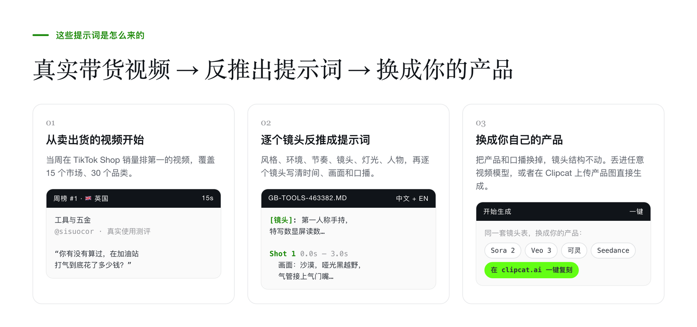
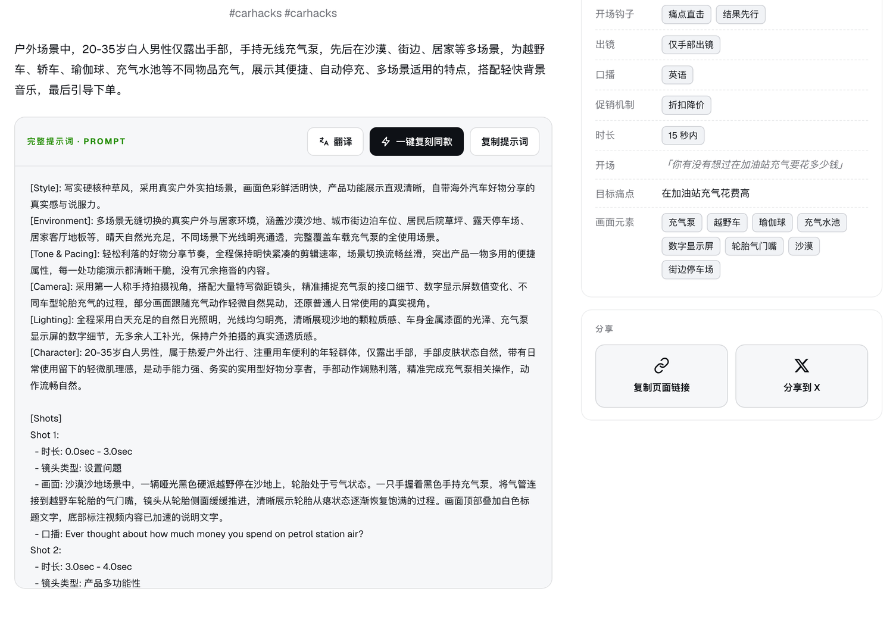
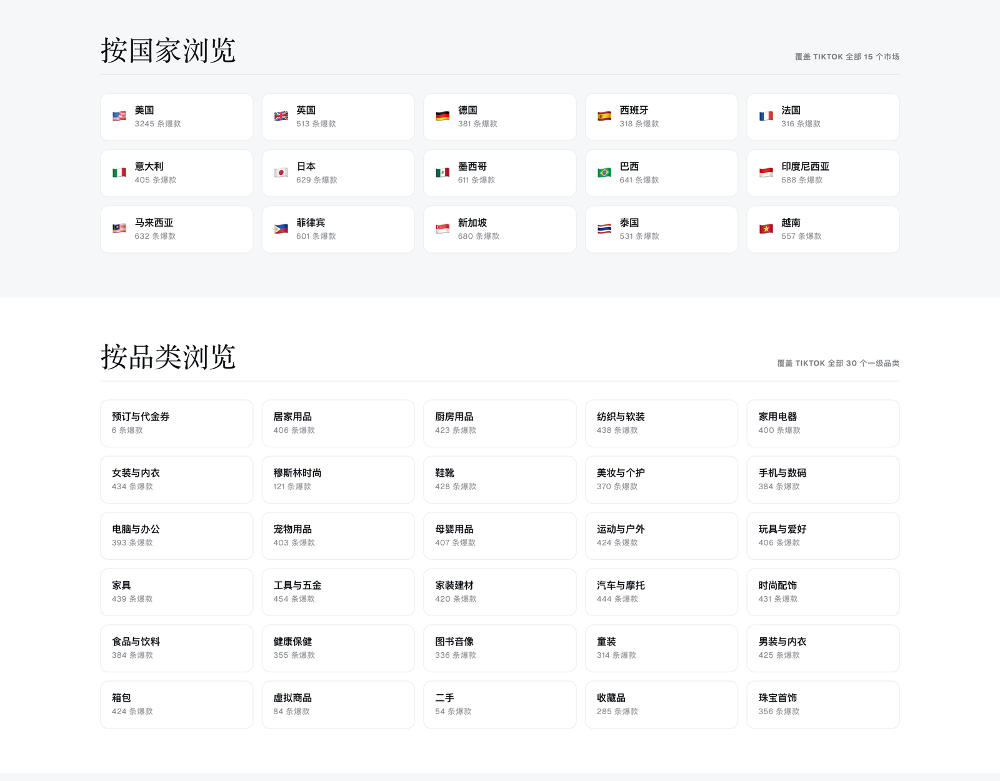

# 🎬 TikTok Shop 爆款带货视频提示词库

[](https://github.com/sindresorhus/awesome)
[](https://github.com/Clipcat-ai/awesome-tiktok-shop-video-prompts)
[](./LICENSE)
[](./CONTRIBUTING.md)

[](https://clipcat.ai/zh/tools/ai-tiktok-videos-prompt?utm_source=github&utm_medium=repo&utm_campaign=prompt-library)
[](https://clipcat.ai/zh/tools/ai-tiktok-videos-prompt?utm_source=github&utm_medium=repo&utm_campaign=prompt-library)
[](https://clipcat.ai/zh/tools/ai-tiktok-videos-prompt?utm_source=github&utm_medium=repo&utm_campaign=prompt-library)
[](https://clipcat.ai/zh/tools/ai-tiktok-videos-prompt?utm_source=github&utm_medium=repo&utm_campaign=prompt-library)

**English → [README.md](./README.md)**

<p align="center">
  <a href="https://clipcat.ai/zh/tools/ai-tiktok-videos-prompt?utm_source=github&utm_medium=repo&utm_campaign=prompt-library"></a>
</p>

**这些提示词是从真实的 TikTok Shop 带货视频反推出来的。** 每条对应一个视频，这个视频当周在它所在的市场和品类里销量排第一。提示词不是人手编的，是照着原视频逐个镜头还原的，每条都附了原视频链接，可以自己对照。

本仓库把 [Clipcat 视频与提示词库](https://clipcat.ai/zh/tools/ai-tiktok-videos-prompt?utm_source=github&utm_medium=repo&utm_campaign=prompt-library) 里的一部分整理成了 Markdown 文件，可以直接在 GitHub 上看、用 grep 搜、fork 之后自己改。完整的库在 clipcat.ai 上：**10,648+ 条视频，覆盖 15 个市场、30 个品类，每天更新**，可以搜索、筛选，也可以传自己的产品图直接生成整条视频。

> 🤖 想让 AI agent 检索这个库，针对**你自己的产品**直接生成一条可以拿去拍的提示词？ 👉 [clipcat-skill](https://github.com/Clipcat-ai/clipcat-skill)

---

## 这些提示词是怎么来的

<p align="center">
  <a href="https://clipcat.ai/zh/tools/ai-tiktok-videos-prompt?utm_source=github&utm_medium=repo&utm_campaign=prompt-library"></a>
</p>

---

## 每条包含什么

`prompts/<市场>/<品类>/` 下每个文件是一条：

- **中英双语提示词** —— 风格、环境、节奏、镜头、灯光、人物，再逐个镜头写清时间、画面和口播；
- **开场第一句话** —— 视频开头说的那句话（原文是英文就照抄，不是英文就翻成英文），以及它对应的痛点；
- **结构化标签** —— 视频形态、钩子类型、出镜情况、促销机制、口播语言；
- **原 TikTok 视频链接** —— 提示词写的是哪个视频，点开就能看。

仓库里不包含视频文件、封面图、商品图和销售数据。见 [NOTICE.md](./NOTICE.md)。

### 一条长什么样

<p align="center">
  <a href="https://clipcat.ai/zh/tools/ai-tiktok-videos-prompt/gb-tools-463382?utm_source=github&utm_medium=repo&utm_campaign=prompt-library"></a>
</p>

<p align="center"><sub>下面这条<a href="https://clipcat.ai/zh/tools/ai-tiktok-videos-prompt/gb-tools-463382?utm_source=github&utm_medium=repo&utm_campaign=prompt-library">在 clipcat.ai 上的页面</a>：同一份提示词，另外还有原视频和复刻按钮。</sub></p>

<details open>
<summary><b>Cordless Tyre Inflator Air… — Real Review (United Kingdom · Tools & Hardware)</b> — <code>gb-tools-463382</code></summary>

```text
[Style]: 写实硬核种草风，采用真实户外实拍场景，画面色彩鲜活明快，产品功能展示直观清晰，自带海外汽车好物分享的真实感与说服力。
[Environment]: 多场景无缝切换的真实户外与居家环境，涵盖沙漠沙地、城市街边泊车位、居民后院草坪、露天停车场、居家客厅地板等，晴天自然光充足，不同场景下光线明亮通透，完整覆盖车载充气泵的全使用场景。

Shot 1:
  - 时长: 0.0sec - 3.0sec
  - 镜头类型: 设置问题
  - 画面: 沙漠沙地场景中，一辆哑光黑色硬派越野停在沙地上，轮胎处于亏气状态。一只手握着黑色手持充气泵，将气管连接到越野车轮胎的气门嘴，镜头从轮胎侧面缓缓推进，清晰展示轮胎从瘪状态逐渐恢复饱满的过程。画面顶部叠加白色标题文字，底部标注视频内容已加速的说明文字。
  - 口播: Ever thought about how much money you spend on petrol station air?
…
```

[看完整条目 →](./prompts/gb/tools-hardware/gb-tools-463382.md) · [看原视频 →](https://www.tiktok.com/share/video/7614465584268463382) · [在 clipcat.ai 一键复刻 →](https://clipcat.ai/zh/tools/ai-tiktok-videos-prompt/gb-tools-463382?utm_source=github&utm_medium=repo&utm_campaign=prompt-library)

</details>

---

## 怎么用

**配任意视频模型用。** 把中文或英文提示词粘进 Sora 2、Veo 3、可灵、Seedance 或你在用的模型。提示词是普通文本，不挑模型，关键的是镜头表。

**换成你自己的产品。** 提示词写的是别人的产品。把产品名称和口播换成你自己的，镜头结构保持不动。

**在 Clipcat 上用。** 每条都链到 [clipcat.ai](https://clipcat.ai/zh/tools/ai-tiktok-videos-prompt?utm_source=github&utm_medium=repo&utm_campaign=prompt-library) 上的同一条提示词，在那里上传自己的产品图，可以直接生成整条视频。

---

## 提示词格式

每个区块是什么意思，见 [docs/prompt-format.md](./docs/prompt-format.md)；13 种开场钩子和 13 种视频形态的定义，见 [docs/hook-taxonomy.md](./docs/hook-taxonomy.md)。

---

## 浏览整个库

<p align="center">
  <a href="https://clipcat.ai/zh/tools/ai-tiktok-videos-prompt?utm_source=github&utm_medium=repo&utm_campaign=prompt-library"></a>
</p>

下面的数字是 [clipcat.ai](https://clipcat.ai/zh/tools/ai-tiktok-videos-prompt?utm_source=github&utm_medium=repo&utm_campaign=prompt-library) 上的视频总数。点任意一行，可以看到这个市场、品类或形态下的视频和提示词。本仓库收录的条目放在 `prompts/<市场>/<品类>/` 目录下。

### 按市场

| 市场 | 视频数 | 市场 | 视频数 |
| --- | ---: | --- | ---: |
| [🇺🇸 美国](https://clipcat.ai/zh/tools/ai-tiktok-videos-prompt/browse/country-us?utm_source=github&utm_medium=repo&utm_campaign=prompt-library) | 3,245 | [🇻🇳 越南](https://clipcat.ai/zh/tools/ai-tiktok-videos-prompt/browse/country-vn?utm_source=github&utm_medium=repo&utm_campaign=prompt-library) | 557 |
| [🇸🇬 新加坡](https://clipcat.ai/zh/tools/ai-tiktok-videos-prompt/browse/country-sg?utm_source=github&utm_medium=repo&utm_campaign=prompt-library) | 680 | [🇹🇭 泰国](https://clipcat.ai/zh/tools/ai-tiktok-videos-prompt/browse/country-th?utm_source=github&utm_medium=repo&utm_campaign=prompt-library) | 531 |
| [🇧🇷 巴西](https://clipcat.ai/zh/tools/ai-tiktok-videos-prompt/browse/country-br?utm_source=github&utm_medium=repo&utm_campaign=prompt-library) | 641 | [🇬🇧 英国](https://clipcat.ai/zh/tools/ai-tiktok-videos-prompt/browse/country-gb?utm_source=github&utm_medium=repo&utm_campaign=prompt-library) | 513 |
| [🇲🇾 马来西亚](https://clipcat.ai/zh/tools/ai-tiktok-videos-prompt/browse/country-my?utm_source=github&utm_medium=repo&utm_campaign=prompt-library) | 632 | [🇮🇹 意大利](https://clipcat.ai/zh/tools/ai-tiktok-videos-prompt/browse/country-it?utm_source=github&utm_medium=repo&utm_campaign=prompt-library) | 405 |
| [🇯🇵 日本](https://clipcat.ai/zh/tools/ai-tiktok-videos-prompt/browse/country-jp?utm_source=github&utm_medium=repo&utm_campaign=prompt-library) | 629 | [🇩🇪 德国](https://clipcat.ai/zh/tools/ai-tiktok-videos-prompt/browse/country-de?utm_source=github&utm_medium=repo&utm_campaign=prompt-library) | 381 |
| [🇲🇽 墨西哥](https://clipcat.ai/zh/tools/ai-tiktok-videos-prompt/browse/country-mx?utm_source=github&utm_medium=repo&utm_campaign=prompt-library) | 611 | [🇪🇸 西班牙](https://clipcat.ai/zh/tools/ai-tiktok-videos-prompt/browse/country-es?utm_source=github&utm_medium=repo&utm_campaign=prompt-library) | 318 |
| [🇵🇭 菲律宾](https://clipcat.ai/zh/tools/ai-tiktok-videos-prompt/browse/country-ph?utm_source=github&utm_medium=repo&utm_campaign=prompt-library) | 601 | [🇫🇷 法国](https://clipcat.ai/zh/tools/ai-tiktok-videos-prompt/browse/country-fr?utm_source=github&utm_medium=repo&utm_campaign=prompt-library) | 316 |
| [🇮🇩 印度尼西亚](https://clipcat.ai/zh/tools/ai-tiktok-videos-prompt/browse/country-id?utm_source=github&utm_medium=repo&utm_campaign=prompt-library) | 588 |  |  |

### 按品类

| 品类 | 视频数 | 品类 | 视频数 |
| --- | ---: | --- | ---: |
| [工具与五金](https://clipcat.ai/zh/tools/ai-tiktok-videos-prompt/browse/cat-tools--hardware?utm_source=github&utm_medium=repo&utm_campaign=prompt-library) | 454 | [宠物用品](https://clipcat.ai/zh/tools/ai-tiktok-videos-prompt/browse/cat-pet-supplies?utm_source=github&utm_medium=repo&utm_campaign=prompt-library) | 403 |
| [汽车与摩托](https://clipcat.ai/zh/tools/ai-tiktok-videos-prompt/browse/cat-automotive--motorcycle?utm_source=github&utm_medium=repo&utm_campaign=prompt-library) | 444 | [家用电器](https://clipcat.ai/zh/tools/ai-tiktok-videos-prompt/browse/cat-household-appliances?utm_source=github&utm_medium=repo&utm_campaign=prompt-library) | 400 |
| [家具](https://clipcat.ai/zh/tools/ai-tiktok-videos-prompt/browse/cat-furniture?utm_source=github&utm_medium=repo&utm_campaign=prompt-library) | 439 | [电脑与办公](https://clipcat.ai/zh/tools/ai-tiktok-videos-prompt/browse/cat-computers--office-equipment?utm_source=github&utm_medium=repo&utm_campaign=prompt-library) | 393 |
| [纺织与软装](https://clipcat.ai/zh/tools/ai-tiktok-videos-prompt/browse/cat-textiles--soft-furnishings?utm_source=github&utm_medium=repo&utm_campaign=prompt-library) | 438 | [手机与数码](https://clipcat.ai/zh/tools/ai-tiktok-videos-prompt/browse/cat-phones--electronics?utm_source=github&utm_medium=repo&utm_campaign=prompt-library) | 384 |
| [女装与内衣](https://clipcat.ai/zh/tools/ai-tiktok-videos-prompt/browse/cat-womenswear--underwear?utm_source=github&utm_medium=repo&utm_campaign=prompt-library) | 434 | [食品与饮料](https://clipcat.ai/zh/tools/ai-tiktok-videos-prompt/browse/cat-food--beverages?utm_source=github&utm_medium=repo&utm_campaign=prompt-library) | 384 |
| [时尚配饰](https://clipcat.ai/zh/tools/ai-tiktok-videos-prompt/browse/cat-fashion-accessories?utm_source=github&utm_medium=repo&utm_campaign=prompt-library) | 431 | [美妆与个护](https://clipcat.ai/zh/tools/ai-tiktok-videos-prompt/browse/cat-beauty--personal-care?utm_source=github&utm_medium=repo&utm_campaign=prompt-library) | 370 |
| [鞋靴](https://clipcat.ai/zh/tools/ai-tiktok-videos-prompt/browse/cat-shoes?utm_source=github&utm_medium=repo&utm_campaign=prompt-library) | 428 | [珠宝首饰](https://clipcat.ai/zh/tools/ai-tiktok-videos-prompt/browse/cat-jewelry-accessories--derivatives?utm_source=github&utm_medium=repo&utm_campaign=prompt-library) | 356 |
| [男装与内衣](https://clipcat.ai/zh/tools/ai-tiktok-videos-prompt/browse/cat-menswear--underwear?utm_source=github&utm_medium=repo&utm_campaign=prompt-library) | 425 | [健康保健](https://clipcat.ai/zh/tools/ai-tiktok-videos-prompt/browse/cat-health?utm_source=github&utm_medium=repo&utm_campaign=prompt-library) | 355 |
| [运动与户外](https://clipcat.ai/zh/tools/ai-tiktok-videos-prompt/browse/cat-sports--outdoor?utm_source=github&utm_medium=repo&utm_campaign=prompt-library) | 424 | [图书音像](https://clipcat.ai/zh/tools/ai-tiktok-videos-prompt/browse/cat-books-magazines--audio?utm_source=github&utm_medium=repo&utm_campaign=prompt-library) | 336 |
| [箱包](https://clipcat.ai/zh/tools/ai-tiktok-videos-prompt/browse/cat-luggage--bags?utm_source=github&utm_medium=repo&utm_campaign=prompt-library) | 424 | [童装](https://clipcat.ai/zh/tools/ai-tiktok-videos-prompt/browse/cat-kids-fashion?utm_source=github&utm_medium=repo&utm_campaign=prompt-library) | 314 |
| [厨房用品](https://clipcat.ai/zh/tools/ai-tiktok-videos-prompt/browse/cat-kitchenware?utm_source=github&utm_medium=repo&utm_campaign=prompt-library) | 423 | [收藏品](https://clipcat.ai/zh/tools/ai-tiktok-videos-prompt/browse/cat-collectibles?utm_source=github&utm_medium=repo&utm_campaign=prompt-library) | 285 |
| [家装建材](https://clipcat.ai/zh/tools/ai-tiktok-videos-prompt/browse/cat-home-improvement?utm_source=github&utm_medium=repo&utm_campaign=prompt-library) | 420 | [穆斯林时尚](https://clipcat.ai/zh/tools/ai-tiktok-videos-prompt/browse/cat-muslim-fashion?utm_source=github&utm_medium=repo&utm_campaign=prompt-library) | 121 |
| [母婴用品](https://clipcat.ai/zh/tools/ai-tiktok-videos-prompt/browse/cat-baby--maternity?utm_source=github&utm_medium=repo&utm_campaign=prompt-library) | 407 | [虚拟商品](https://clipcat.ai/zh/tools/ai-tiktok-videos-prompt/browse/cat-virtual-products?utm_source=github&utm_medium=repo&utm_campaign=prompt-library) | 84 |
| [玩具与爱好](https://clipcat.ai/zh/tools/ai-tiktok-videos-prompt/browse/cat-toys--hobbies?utm_source=github&utm_medium=repo&utm_campaign=prompt-library) | 406 | [二手](https://clipcat.ai/zh/tools/ai-tiktok-videos-prompt/browse/cat-pre-owned?utm_source=github&utm_medium=repo&utm_campaign=prompt-library) | 54 |
| [居家用品](https://clipcat.ai/zh/tools/ai-tiktok-videos-prompt/browse/cat-home-supplies?utm_source=github&utm_medium=repo&utm_campaign=prompt-library) | 406 | [预订与代金券](https://clipcat.ai/zh/tools/ai-tiktok-videos-prompt/browse/cat-bookings--vouchers?utm_source=github&utm_medium=repo&utm_campaign=prompt-library) | 6 |

### 按视频形态

| 形态 | 视频数 | 形态 | 视频数 |
| --- | ---: | --- | ---: |
| [手持商品展示](https://clipcat.ai/zh/tools/ai-tiktok-videos-prompt/browse/type-handheld-demo?utm_source=github&utm_medium=repo&utm_campaign=prompt-library) | 4,437 | [口播介绍](https://clipcat.ai/zh/tools/ai-tiktok-videos-prompt/browse/type-talking-head?utm_source=github&utm_medium=repo&utm_campaign=prompt-library) | 615 |
| [真实使用测评](https://clipcat.ai/zh/tools/ai-tiktok-videos-prompt/browse/type-real-review?utm_source=github&utm_medium=repo&utm_campaign=prompt-library) | 1,466 | [互动剧情演绎](https://clipcat.ai/zh/tools/ai-tiktok-videos-prompt/browse/type-story-skit?utm_source=github&utm_medium=repo&utm_campaign=prompt-library) | 243 |
| [促销卖点强推](https://clipcat.ai/zh/tools/ai-tiktok-videos-prompt/browse/type-promo-pitch?utm_source=github&utm_medium=repo&utm_campaign=prompt-library) | 1,297 | [第一人称开箱](https://clipcat.ai/zh/tools/ai-tiktok-videos-prompt/browse/type-unboxing-pov?utm_source=github&utm_medium=repo&utm_campaign=prompt-library) | 124 |
| [场景化生活秀](https://clipcat.ai/zh/tools/ai-tiktok-videos-prompt/browse/type-lifestyle-scene?utm_source=github&utm_medium=repo&utm_campaign=prompt-library) | 860 | [品牌短TVC](https://clipcat.ai/zh/tools/ai-tiktok-videos-prompt/browse/type-brand-tvc?utm_source=github&utm_medium=repo&utm_campaign=prompt-library) | 73 |
| [产品镜头特写](https://clipcat.ai/zh/tools/ai-tiktok-videos-prompt/browse/type-product-closeup?utm_source=github&utm_medium=repo&utm_campaign=prompt-library) | 774 | [ASMR感官沉浸](https://clipcat.ai/zh/tools/ai-tiktok-videos-prompt/browse/type-asmr?utm_source=github&utm_medium=repo&utm_campaign=prompt-library) | 26 |
| [OOTD穿搭展示](https://clipcat.ai/zh/tools/ai-tiktok-videos-prompt/browse/type-ootd?utm_source=github&utm_medium=repo&utm_campaign=prompt-library) | 689 | [多品横向对比](https://clipcat.ai/zh/tools/ai-tiktok-videos-prompt/browse/type-product-compare?utm_source=github&utm_medium=repo&utm_campaign=prompt-library) | 9 |

### 按开场钩子

本仓库这些条目的开场类型分布。每种钩子是什么意思，见[钩子分类](./docs/hook-taxonomy.md#opening-hooks)。

| 钩子 | 占比 | 钩子 | 占比 |
| --- | ---: | --- | ---: |
| [结果先行](./docs/hook-taxonomy.md#opening-hooks) | 30% | [剧情冲突](./docs/hook-taxonomy.md#opening-hooks) | 2% |
| [场景代入](./docs/hook-taxonomy.md#opening-hooks) | 25% | [反常识反差](./docs/hook-taxonomy.md#opening-hooks) | 1% |
| [痛点直击](./docs/hook-taxonomy.md#opening-hooks) | 19% | [身份认同](./docs/hook-taxonomy.md#opening-hooks) | 1% |
| [利益直给](./docs/hook-taxonomy.md#opening-hooks) | 9% | [效果对比](./docs/hook-taxonomy.md#opening-hooks) | <1% |
| [悬念好奇](./docs/hook-taxonomy.md#opening-hooks) | 9% | [沉浸感官](./docs/hook-taxonomy.md#opening-hooks) | <1% |
| [促销紧迫感](./docs/hook-taxonomy.md#opening-hooks) | 3% |  |  |

---

## 机器可读数据

`data/prompts.jsonl` —— 一行一个 JSON 对象，字段和文件头部一致，另外带中英文提示词全文。用来给 agent 调用或建 RAG 索引，不适合直接阅读。

## 参与贡献

请提交 **TikTok 视频链接**，不用自己写提示词 —— 反推由我们的流水线完成，并会标注原作者。也欢迎纠正已有条目里的错误。见 [CONTRIBUTING.md](./CONTRIBUTING.md)。

## 许可

提示词按 [CC BY 4.0](./LICENSE) 发布，署名格式 `Prompts from Awesome TikTok Shop Video Prompts by Clipcat, CC BY 4.0`。从原视频引用的口播台词、以及我们对它的翻译，**都不在授权范围内**，版权归原作者。商用前请先读 [NOTICE.md](./NOTICE.md)。
